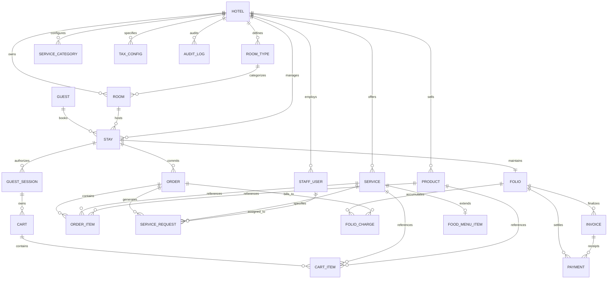

# Jayaasi Rooms — Relationship Map

This document visualizes and defines all foreign key relationships, cardinalities, cascade constraints, and query paths across the database.

---

## 1. Visual Entity Relationship Diagram (ERD)

---

## 2. Cardinalities & Foreign Key Constraints

| Relationship | Cardinality | Parent Table | Child Table | Foreign Key Column | On Delete Action | Rationale |
|---|---|---|---|---|---|---|
| Hotel to RoomType | 1 to Many | `hotels` | `room_types` | `hotel_id` | `RESTRICT` | Prevent deletion of hotel with active room types. |
| Hotel to Room | 1 to Many | `hotels` | `rooms` | `hotel_id` | `RESTRICT` | Protect hotel physical room inventory. |
| RoomType to Room | 1 to Many | `room_types`| `rooms` | `room_type_id` | `RESTRICT` | Cannot delete a room category if rooms exist. |
| Hotel to Stay | 1 to Many | `hotels` | `stays` | `hotel_id` | `RESTRICT` | Preserve historical guest stays. |
| Guest to Stay | 1 to Many | `guests` | `stays` | `guest_id` | `RESTRICT` | Preserve guest stay history. |
| Room to Stay | 1 to Many | `rooms` | `stays` | `room_id` | `RESTRICT` | Preserve historical room occupancy. |
| Stay to GuestSession | 1 to Many | `stays` | `guest_sessions` | `stay_id` | `CASCADE` | Sessions expire with stay closure. |
| GuestSession to Cart | 1 to Many | `guest_sessions`| `carts` | `guest_session_id`| `CASCADE` | Temporary cart removed if session revoked. |
| Cart to CartItem | 1 to Many | `carts` | `cart_items` | `cart_id` | `CASCADE` | Cart items deleted if cart is cleared. |
| Stay to Order | 1 to Many | `stays` | `orders` | `stay_id` | `RESTRICT` | Orders are permanent financial records. |
| Order to OrderItem | 1 to Many | `orders` | `order_items` | `order_id` | `RESTRICT` | Order line items must never be orphaned. |
| Order to ServiceRequest| 1 to Many | `orders` | `service_requests` | `order_id` | `SET NULL` | Request can stand alone (e.g. free towels). |
| Service to ServiceRequest| 1 to Many | `services` | `service_requests` | `service_id` | `RESTRICT` | Protect active service dispatches. |
| Stay to Folio | 1 to 1 | `stays` | `folios` | `stay_id` | `RESTRICT` | One master billing folio per guest stay. |
| Folio to FolioCharge | 1 to Many | `folios` | `folio_charges` | `folio_id` | `RESTRICT` | Financial charges cannot be deleted casually. |
| Folio to Invoice | 1 to Many | `folios` | `invoices` | `folio_id` | `RESTRICT` | Invoices are official tax records. |
| Folio to Payment | 1 to Many | `folios` | `payments` | `folio_id` | `RESTRICT` | Settlement payments are permanent. |
| Service to FoodMenuItem| 1 to 1 | `services` | `food_menu_items` | `service_id` | `CASCADE` | Food details delete with service. |

---

## 3. High-Traffic Query Paths & Indexes

1. **Guest Room Authorization**:
   - `SELECT * FROM guest_sessions WHERE token_hash = ? AND expires_at > now() AND revoked_at IS NULL;`
   - **Index**: `guest_sessions(token_hash)`
2. **Admin Real-Time Requests Feed**:
   - `SELECT * FROM service_requests WHERE hotel_id = ? AND status != 'COMPLETED' ORDER BY requested_at DESC;`
   - **Composite Index**: `service_requests(hotel_id, status, requested_at)`
3. **Room Live Occupancy Matrix**:
   - `SELECT * FROM rooms WHERE hotel_id = ? AND active = true ORDER BY floor, room_number;`
   - **Composite Index**: `rooms(hotel_id, floor, room_number)`
4. **Active Stay Folio Charges**:
   - `SELECT * FROM folio_charges WHERE folio_id = ? ORDER BY posted_at ASC;`
   - **Index**: `folio_charges(folio_id, posted_at)`
